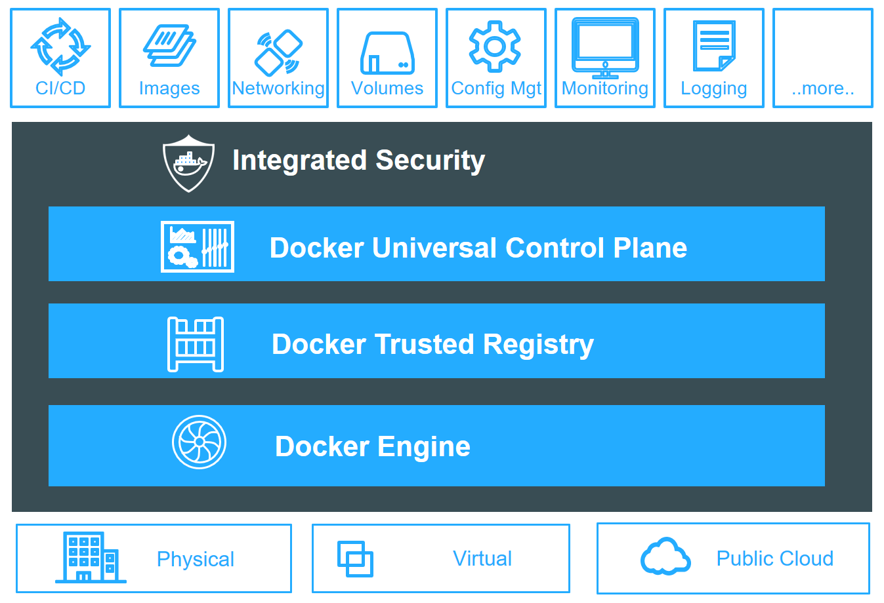

# Introduction to Docker

---
## About me
### Frederik Mogensen

Software Pilot at Trifork
Focus on Docker, orchestration and ci/cd


---
## Agenda

- Containers are NOT VMs
- Working with Docker (Build, Ship, Run)
- Container Architecture
- But Why?
- Multi-container applications

- Docker Compose
- Docker Swarm
- Getting started
- Q & A

---
# Containers are not VMs

---
## Containers are NOT VMs

- Easy connection to make
- Fundamentally different architectures
- Fundamentally different benefits

---
## VMs


---
## Containers


---
## They’re different, not mutually exclusive


---
# Build, Ship, and Run

---
## Docker vocabulary

- Docker Image
  - The basis of a Docker container. Represents a full application.
- Docker Container 
  - The standard executing unit
- Docker Engine 
  - Creates, ships and runs Docker containers
- Registry Service
  - Cloud or server based storage and distribution of images


---
## Basic Docker Commands

```bash
docker pull mikegcoleman/catweb:latest
docker images
docker run -d -p 5000:5000 --name catweb mikegcoleman/catweb:latest
docker ps
docker stop catweb // or <container id>
docker rm catweb // or <container id>
docker rmi mikegcoleman/catweb:latest // or <image id>
```

---
## Dockerfile – Linux Example

- Instructions on how to build a Docker image
- Looks very similar to "native" commands

```dockerfile
FROM alpine:latest

RUN apk add --update py-pip

RUN pip install --upgrade pip

COPY requirements.txt /usr/src/app/
RUN pip install --no-cache-dir -r /usr/src/app/requirements.txt

COPY app.py /usr/src/app/
COPY templates/index.html /usr/src/app/templates/

EXPOSE 5000

CMD ["python", "/usr/src/app/app.py"]
```

@[1](Our base image)
@[3](Install python and pip)
@[5](Upgrade pip)
@[7-8](Install Python modules needed by the Python app)
@[10-11](Copy files required for the app to run)
@[13](Tell the port number the container should expose)
@[15](How should docker start the application)

---
## Basic Docker Commands

```dockerfile
FROM alpine:latest
RUN apk add --update py-pip
RUN pip install --upgrade pip
COPY requirements.txt /usr/src/app/
RUN pip install --no-cache-dir -r /usr/src/app/requirements.txt
COPY app.py /usr/src/app/
COPY templates/index.html /usr/src/app/templates/
EXPOSE 5000
CMD ["python", "/usr/src/app/app.py"]
```

```shell
docker build –t mikegcoleman/catweb:2.0 .
docker push mikegcoleman/catweb:2.0
```

---
## Put it all together


---
## Demo

Build, Ship, and Run

---
## Now you try it!

- Visit http://docs.docker.com/installation
- Install the right version of Docker for your machine
- Docker for Mac
- Docker for Windows
- After Docker is installed, run Catweb

```shell
$ docker run –d –p 5000:5000 --name catweb mikegcoleman/catweb
```

Browse to port 5000 on your machine: http://localhost:5000

---
## Docker Container Architecture

---
## Image Layers


---
## Docker File System

- Logical file system by grouping different file system primitives into branches (directories, file systems, subvolumes, snapshots)

- Each branch represents a layer in a Docker image

- Allows images to be constructed / deconstructed as needed vs. a huge monolithic image (ala traditional virtual machines)

- When a container is started a writeable layer is added to the “top” of the file system

---
## Copy on Write

- Super efficient:
  - Sub second instantiation times for containers
  - New container can take &lt;1 Mb of space

- Containers appears to be a copy of the original image
- But, it is really just a link to the original shared image

- If someone writes a change to the file system, a copy of the affected file/directory is "copied up"

---
## What about data persistence?

- Volumes allow you to specify a directory in the container that exists outside of the
docker file system structure
- Can be used to share (and persist) data between containers

- Directory persists after the container is deleted
  - Unless you explicitly delete it

- Can be created in a Dockerfile or via CLI

---
## One platform - one journey
___For all applications___

1. Containerize Legacy Applications
   - Lift and shift for portability and efficiency
1. Transform Legacy to Microservices
   - Look for shared services to transform
1. Accelerate New Applications
   - Greenfield innovation

---
## Docker Datacenter
_Containers in production_



Note:
- Enterprise container orchestration, management and security for dev and ops
- Available today for Linux environments
- Q4 2016 beta for Windows environments 


---
## Hands On

#### Exercises [here](https://github.com/mogensen/docker-handson-training/tree/master/1-Intro-to-docker/Exercises.md)
